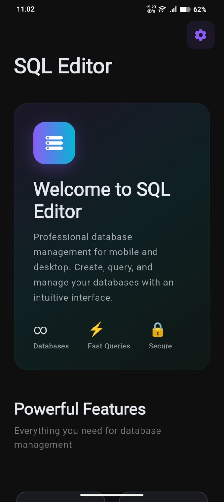
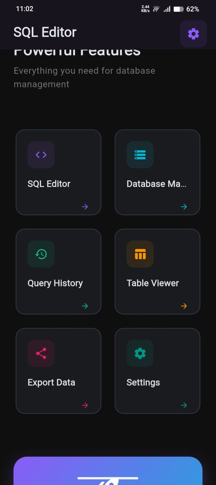
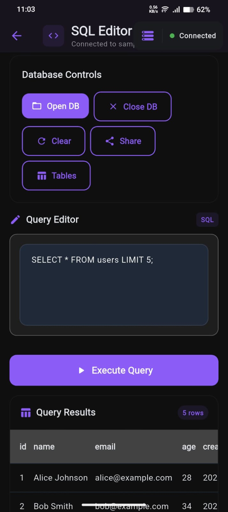
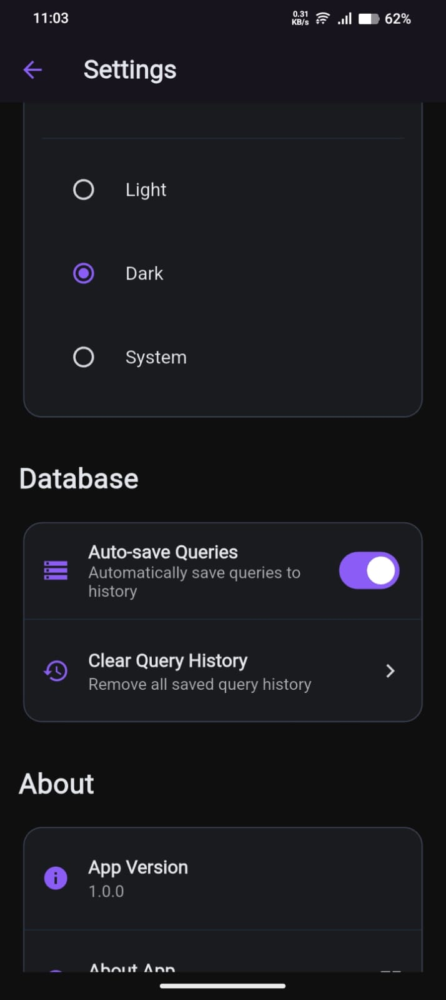
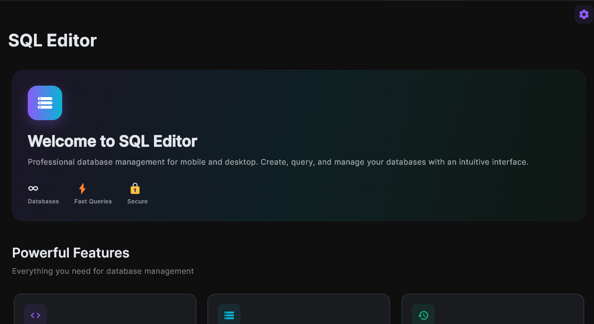
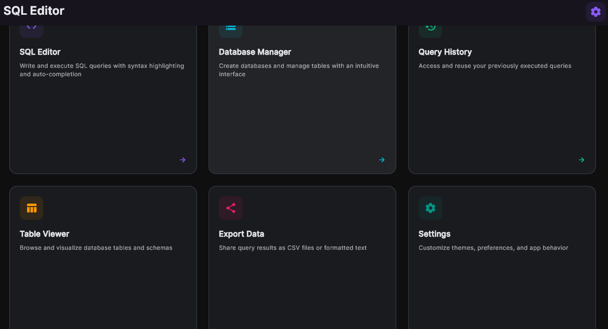
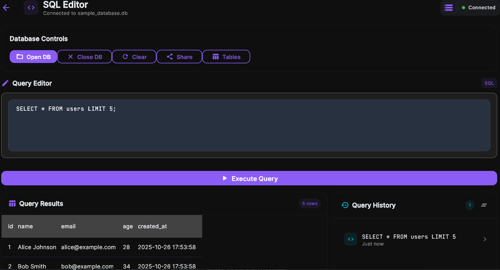
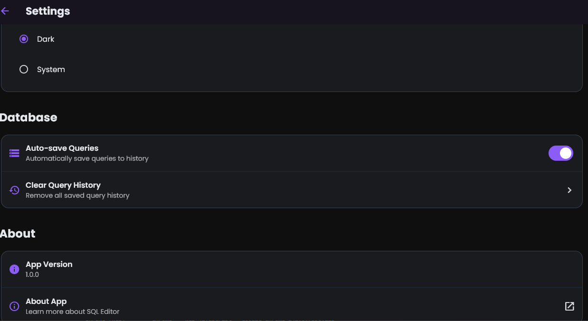

# SQL Editor - Mobile & Desktop SQL Database Manager

A powerful, cross-platform SQL database editor built with Flutter that provides a seamless experience for managing SQLite databases on both mobile and desktop platforms.

## Screenshots

### Mobile

<table>
  <tr>
    <td width="25%" align="center">
      
      <br />
      <b>Home (main)</b>
    </td>
    <td width="25%" align="center">
      
      <br />
      <b>Home</b>
    </td>
    <td width="25%" align="center">
      
      <br />
      <b>SQL Editor</b>
    </td>
    <td width="25%" align="center">
      
      <br />
      <b>Settings</b>
    </td>
  </tr>
</table>

### Desktop

<table>
  <tr>
    <td width="50%" align="center">
      
      <br />
      <b>Home (main)</b>
    </td>
    <td width="50%" align="center">
      
      <br />
      <b>Home</b>
    </td>
  </tr>
  <tr>
    <td width="50%" align="center">
      
      <br />
      <b>SQL Editor</b>
    </td>
    <td width="50%" align="center">
      
      <br />
      <b>Settings</b>
    </td>
  </tr>
</table>


## ✨ Features

### 🗄️ Database Management
- **Create New Databases**: Build SQLite databases from scratch
- **Open Existing Databases**: Import and work with existing `.db` files
- **Sample Database**: Auto-generated sample database with users and products tables for testing
- **Database Schema Viewer**: Explore table structures and relationships

### 📝 SQL Editor
- **Smart Query Editor**: Clean, responsive text editor optimized for SQL
- **Monospace Font**: Code-friendly typography with proper spacing
- **Auto-Growing Text Area**: Editor expands dynamically with your content
- **Theme Support**: Adapts to light and dark themes seamlessly

### 🔍 Query Execution & Results
- **Live Query Execution**: Run SQL queries with real-time results
- **Data Table Display**: Clean, scrollable table view for query results
- **Error Handling**: Helpful error messages for debugging SQL issues
- **Row Count Display**: See exactly how many rows your queries return

### 📊 Query History
- **Automatic History**: All executed queries are automatically saved
- **Quick Access**: Tap any historical query to reload it in the editor
- **Swipe to Delete**: Remove individual queries with intuitive gestures
- **Clear All**: Bulk delete entire query history with confirmation
- **Relative Timestamps**: See when queries were executed ("2 minutes ago")

### 🎨 User Interface
- **Material 3 Design**: Modern, beautiful interface following latest design principles
- **Responsive Layout**: Optimized for both mobile and desktop screens
- **Dark/Light Themes**: Toggle between themes with system integration
- **Smooth Animations**: Polished transitions and interactions

### 🔧 Advanced Features
- **File Export**: Share query results and database files
- **Cross-Platform**: Runs on Android, iOS, Linux, macOS, and Windows
- **Offline First**: No internet connection required
- **State Management**: Powered by Riverpod for reliable app state

## 🚀 Installation

### Prerequisites
- Flutter SDK (>= 3.0.0)
- Dart SDK (>= 3.0.0)
- Platform-specific development tools:
  - **Android**: Android Studio/SDK
  - **iOS**: Xcode (macOS only)
  - **Desktop**: Platform-specific build tools

### Clone & Setup
```bash
git clone https://github.com/Amanbig/Sql-Edit.git
cd sql_edit
flutter pub get
```

### Run the App
```bash
# Mobile (Android/iOS)
flutter run

# Desktop
flutter run -d linux    # Linux
flutter run -d macos    # macOS
flutter run -d windows  # Windows
```

## 📱 Usage

### Getting Started
1. **Launch the app** - You'll see the welcome screen with feature overview
2. **Create or Open Database** - Use the Database Manager to start working
3. **Write SQL Queries** - Use the built-in editor with helpful examples
4. **Execute & View Results** - See your data in a clean table format
5. **Review History** - Access previously executed queries anytime

### Sample Queries
The app includes a sample database with example queries:

```sql
-- View all users
SELECT * FROM users LIMIT 5;

-- Filter products by category
SELECT * FROM products WHERE category = 'Electronics';

-- Join users and products with aggregation
SELECT u.name, COUNT(p.id) as product_count
FROM users u, products p
WHERE u.age > 25
GROUP BY u.name;
```

### Database Operations
- **Open Database**: Import existing SQLite files
- **Create Tables**: Use DDL statements to create new tables
- **Insert Data**: Add records with INSERT statements
- **Query Data**: Use SELECT statements to retrieve information
- **Update/Delete**: Modify existing records

## 🏗️ Architecture

### Tech Stack
- **Framework**: Flutter 3.x
- **State Management**: Riverpod
- **Database**: SQLite with `sqflite` and `sqflite_common_ffi`
- **UI Components**: Material 3, `data_table_2`
- **Typography**: Google Fonts (Inter, JetBrains Mono)
- **File Operations**: `file_picker`, `share_plus`

### Project Structure
```
lib/
├── main.dart                 # App entry point
├── models/                   # Data models
│   ├── DatabaseInfo.dart
│   ├── QueryResult.dart
│   └── QueryHistory.dart
├── providers/                # Riverpod providers
│   ├── DatabaseServiceProvider.dart
│   ├── QueryServiceProvider.dart
│   └── ThemeProvider.dart
├── screens/                  # UI screens
│   ├── home/
│   ├── sqlEditScreen/
│   ├── database/
│   └── settings/
├── services/                 # Business logic
│   ├── Database.dart
│   ├── Query.dart
│   └── QueryHistory.dart
└── routes/                   # Navigation
    └── routes.dart
```

## 🛠️ Development

### Building for Release
```bash
# Android APK
flutter build apk --release

# iOS IPA (requires macOS)
flutter build ios --release

# Desktop executable
flutter build linux --release
flutter build macos --release
flutter build windows --release
```

### Code Quality
```bash
# Run static analysis
flutter analyze

# Run tests
flutter test

# Format code
flutter format .
```

## 🚀 CI/CD with GitHub Actions

This project includes comprehensive GitHub Actions workflows for automated building, testing, and deployment across all supported platforms.

### Available Workflows

#### 1. **Mobile Build** (`.github/workflows/mobile.yml`)
- **Triggers**: Push to `main`/`develop`, PRs to `main`, manual dispatch
- **Platforms**: Android (APK + AAB), iOS (Archive)
- **Artifacts**: 
  - `android-apk`: Release APK for direct installation
  - `android-aab`: App Bundle for Google Play Store
  - `ios-archive`: iOS archive for App Store deployment

#### 2. **Desktop Build** (`.github/workflows/desktop.yml`)
- **Triggers**: Push to `main`/`develop`, PRs to `main`, manual dispatch
- **Platforms**: Windows, macOS, Linux
- **Artifacts**:
  - `windows-app`: Windows executable package (ZIP)
  - `macos-app`: macOS application bundle (ZIP)
  - `linux-app`: Linux application package (TAR.GZ)

#### 3. **Web Build** (`.github/workflows/web.yml`)
- **Triggers**: Push to `main`/`develop`, PRs to `main`, manual dispatch
- **Features**:
  - Builds optimized web application
  - Auto-deploys to GitHub Pages on `main` branch
  - Generates `web-app` artifact for manual deployment

#### 4. **Test & Code Quality** (`.github/workflows/test.yml`)
- **Triggers**: Push to `main`/`develop`, PRs to `main`, manual dispatch
- **Features**:
  - Code formatting verification (`dart format`)
  - Static analysis (`flutter analyze`)
  - Unit test execution with coverage
  - Integration test execution (Linux desktop)
  - Dependency vulnerability scanning
  - Security analysis with Super Linter
  - Coverage upload to Codecov

#### 5. **Release Build** (`.github/workflows/release.yml`)
- **Triggers**: Git tags (`v*`), manual dispatch with version input
- **Features**:
  - Builds all platforms simultaneously
  - Creates GitHub release with all artifacts
  - Versioned artifact naming
  - Auto-generates release notes

### Setting Up GitHub Actions

#### Prerequisites
1. **Repository Setup**: Ensure your repository has Actions enabled
2. **Secrets Configuration** (for advanced features):
   ```
   CODECOV_TOKEN     # For code coverage (optional)
   ```

#### For iOS Deployment (Optional)
To enable iOS builds with code signing, add these secrets:
```
IOS_CERTIFICATE_BASE64    # Base64 encoded .p12 certificate
IOS_CERTIFICATE_PASSWORD  # Certificate password
IOS_PROVISIONING_PROFILE  # Base64 encoded provisioning profile
IOS_TEAM_ID              # Apple Developer Team ID
```

#### For Android Deployment (Optional)
To enable signed Android builds, add these secrets:
```
ANDROID_KEYSTORE_BASE64   # Base64 encoded keystore file
ANDROID_KEYSTORE_PASSWORD # Keystore password
ANDROID_KEY_ALIAS        # Key alias
ANDROID_KEY_PASSWORD     # Key password
```

### Workflow Usage

#### Manual Builds
1. Go to **Actions** tab in your repository
2. Select desired workflow (Mobile, Desktop, Web, etc.)
3. Click **Run workflow**
4. Choose branch and parameters
5. Download artifacts from completed runs

#### Automatic Builds
- **Push to `main`**: Triggers all workflows + web deployment
- **Push to `develop`**: Triggers build workflows (no deployment)
- **Pull Requests**: Triggers test and build workflows
- **Create Tag**: Triggers release workflow

#### Creating Releases
1. **Tag-based Release** (Recommended):
   ```bash
   git tag v1.0.0
   git push origin v1.0.0
   ```

2. **Manual Release**:
   - Go to Actions → Release Build
   - Click "Run workflow"
   - Enter version (e.g., `v1.0.0`)
   - All platform builds will be created and released

### Workflow Customization

#### Flutter Version
Update Flutter version in all workflow files:
```yaml
flutter-version: '3.24.3'  # Change to desired version
```

#### Build Configuration
Modify build commands in workflows:
```yaml
# For release builds with specific parameters
- name: Build Android APK
  run: flutter build apk --release --build-name=1.0.0 --build-number=1
```

#### Platform-Specific Settings
- **Windows**: Modify packaging in `desktop.yml`
- **macOS**: Add code signing steps if needed
- **Linux**: Install additional dependencies as required
- **Android**: Configure signing for Play Store deployment
- **iOS**: Add provisioning profiles for App Store deployment

## 🤝 Contributing

1. Fork the repository
2. Create a feature branch (`git checkout -b feature/amazing-feature`)
3. Commit your changes (`git commit -m 'Add amazing feature'`)
4. Push to the branch (`git push origin feature/amazing-feature`)
5. Open a Pull Request

### Development Guidelines
- Follow Flutter/Dart style guidelines
- Write tests for new features
- Update documentation for API changes
- Ensure cross-platform compatibility

## 📋 Roadmap

### Upcoming Features
- [ ] **Export Formats**: CSV, JSON, XML export options
- [ ] **Query Autocompletion**: Intelligent SQL suggestions
- [ ] **Database Backup**: Automated backup and restore
- [ ] **Multi-tab Editing**: Work with multiple queries simultaneously
- [ ] **Visual Query Builder**: Drag-and-drop query construction
- [ ] **Database Comparison**: Compare schemas and data between databases

### Performance Improvements
- [ ] **Large Dataset Handling**: Pagination for massive result sets
- [ ] **Query Optimization**: Execution plan analysis
- [ ] **Memory Management**: Better handling of large databases

## 🐛 Known Issues

- Line numbers removed from SQL editor to prevent display issues
- Large result sets may impact performance on older devices
- Desktop file picker styling varies by platform

## 📄 License

This project is licensed under the MIT License - see the [LICENSE](LICENSE) file for details.

## 👨‍💻 Author

**Your Name**
- GitHub: [@Amanbig](https://github.com/Amanbig)
- Email: amanpreetsinghjhiwant7@gmail.com

## 🙏 Acknowledgments

- Flutter team for the amazing framework
- SQLite for the robust database engine
- Contributors to the open-source packages used in this project
- Material Design team for the beautiful design system

---

**Built with ❤️ using Flutter**